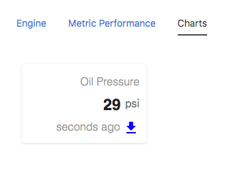
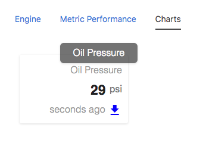
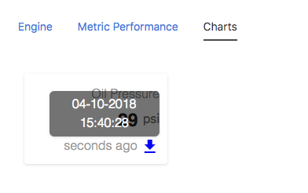

## Node Type Templates: Card

### Introduction

The purpose of the mi-card tag is to provide quick and easy ways to view timeseries data and latest channel values without having to think about design. 

## Syntax


At its core, the mi-card can show the latest data values for a single channel.



```
<sample-template>

    <mi-card label="Oil Pressure" channel="oil_pressure"  unit="psi"
            timestamp="Tue Apr 10 2018 15:40:28 GMT-0500 (CDT)" 					
            download={true} modal={false} 
            color="blue" tooltip={true} />

</sample-template>

```

If the tooltip is set to true then there will be a hover text over the label. The timestamp is always shown as relative to the present and on default will show date and time on hover. Both examples are shown below.





Similar to the mi-well, the mi-card only needs channel to show value... it would also help to include a label so the viewer knows what channel you are referring to. This is a very dumb component except for its ability to find the latest channel value, everything else has to be passed down as an opts. 


Below we will cover the opts that can be passed to mi-card.

---

**channel**

Mandatory. String of the literal channel name. This is what fetches the channel value. 

---

**label**

Optional but necessary for context. String for card label

---

**unit**

Optional. String to represent channel value's unit.

---

**timestamp**

Optional. UTC String to represent time relative to the present.

---

**download**

Optional. Renders download button.

---

**modal**

Optional. Renders download modal button.

---

**color**

Optional. Accepts hex, rgb, rgba, and color strings. Determines the color of the buttons inside the card.

---

**tooltip**

Optional. Determines whether or not there is a hover tooltip text on the card label. Useful for super long card label strings that bleed out of normal layout.

---
