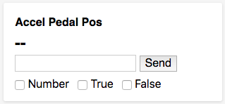

## Node Type Templates: Channel Debug

### Introduction

The purpose of the mi-channel-debug is to provide the user with the ability to publish/cloud new values to a specific channel on the currently viewed node.  

Channel value is websocketed.

## Syntax


At its core, the mi-channel-debug is a either a dev tool or admin tool. This code shows how to render all channels in a node. Alternatively you can just pass the channel name as a string to the channel opt.



```
<sample-template>

    <div class='w-100 w-50-m w-25-l fl' each={ channel in channels }>
      <div class='card pa3 ma3'>
        <mi-channel-debug channel={channel} />
      </div>
    </div>

    <script>
      var tag = this;
      tag.channels = [];
      
      var chns = tag.opts.node.nodeType.channels;
      for(var key in chns){
        tag.channels.push(key)
      }

    </script>

</sample-template>

```

Below we will cover the opts that can be passed to mi-channel-debug.

---

**channel**

Mandatory. String of the literal channel name. Used for getting vanity name and current value. 

---