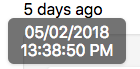
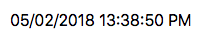

## Node Type Templates: Channel Time

### Introduction

The purpose of the mi-channel-time is to provide the user with a channel time that is updated in real-time.

The timestamp is websocketed.

## Syntax


At its core, the mi-channel-time is a websocketed string that can fit into any design.



```
<sample-template>

    <mi-channel-time channel='fuel_rate' relative={true} tooltip={true}/>

</sample-template>

```

If you dont have the tooltip or relative on then this is the output.



```
<sample-template>

    <mi-channel-time channel='fuel_rate'/>

</sample-template>

```

Below we will cover the opts that can be passed to mi-channel-time.

---

**channel**

Mandatory. String of the literal channel name. Used for getting current time and subscribing to the websocket channel. 

---

**relative**

Optional. Boolean. Turns the date string into a reference point from the present time.  

---

**tooltip**

Optional. Boolean. When hovering on the label, show the tooltip below the timestamp, meant to work in combination with the relative option. 

---