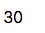

## Node Type Templates: Channel Value

### Introduction

The purpose of the mi-channel-value is to provide the user with a channel value that is updated in real-time. 

The channel value is websocketed.

## Syntax


At its core, the mi-channel-value is a websocketed string that can fit into any design.



```
<sample-template>

    <mi-channel-value channel='fuel_rate' />

</sample-template>

```

Below we will cover the opts that can be passed to mi-channel-value.

---

**channel**

Mandatory. String of the literal channel name. Used for getting current value and subscribing to the websocket channel. 

---