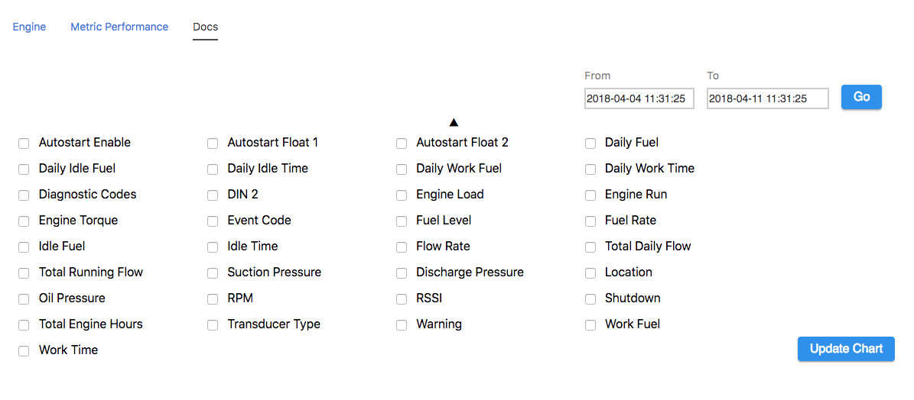
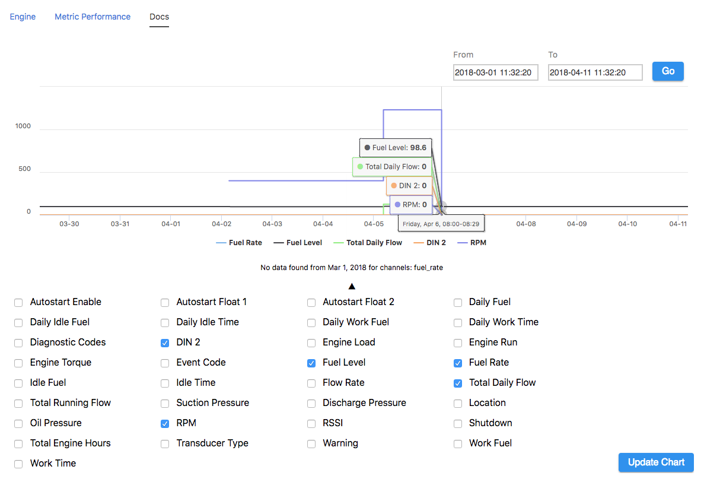
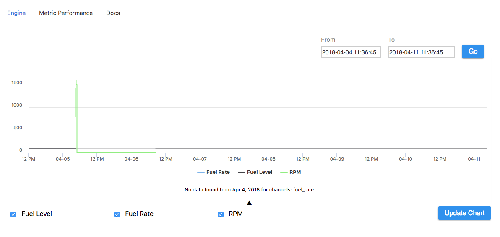

## Node Type Templates: Custom Chart

### Introduction

The purpose of the mi-custom-chart tag is to provide the user with a list of channels they can select in order to construct their own chart.

## Syntax


At its core, the mi-custom-chart is a quick and easy way of visualizing channel names and creating a graph with those inputs.




```
<sample-template>
    
    <mi-custom-chart />

</sample-template>

```

By default the mi-custom-chart selects all channels, you can also pass an array of channels to show only a specific set and not overwhelm the end user with options. Not all options are chartable. 



```
<sample-template>

    <mi-custom-chart channels={['fuel_level','fuel_rate','rpm']}/>

</sample-template>

```


## Notes

When passing an array of custom channels to show, You will know that it is working if you see their checkbox and vanity names, if not then double check the spelling of the channel name string in the array and make sure that name exists on that node. If you make a spelling mistake, the component will break, and likely anything else on the template will not show either. 

---

**channels**

Optional. An array of strings. Each string represents a node channel name. 

---