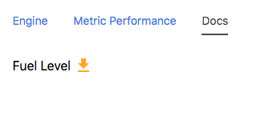

## Node Type Templates: Download History

### Introduction

The purpose of the mi-download-history tag is to allow the user to download a CSV file of a node channel's history.

## Syntax


At its core, the mi-download-history is a cool icon button for one click download action.



```
<sample-template>

    <span class='v-mid'>
        Fuel Level
    </span>
    <mi-download-history color='orange' channel='fuel_level' />

</sample-template>

```

## Notes

The history fetch is currently set to 30 days. 

---

**channel**

Mandatory. String of the channel name that is used to fetch historical data.

---

**color**

Optional. Accepts hex, rgb, rgba, or color string to change icon color. Default is black.

---
