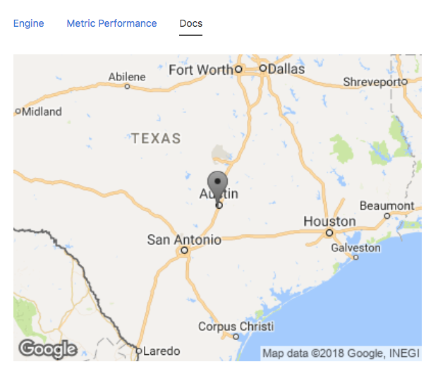

## Node Type Templates: GPS Image

### Introduction

The purpose of the mi-gps-image tag is to provide an image of that node's location. The image is a link to google maps. 

## Syntax


Super easy. No inputs needed.



```
<sample-template>

    <mi-gps-image/>

</sample-template>

```

## Note

Warning: won't do anything if your node does not have a location. 