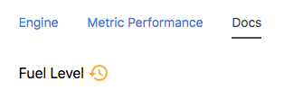
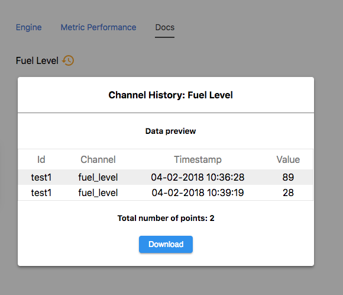

## Node Type Templates: History Modal

### Introduction

The purpose of the mi-history-modal tag is to provide the user with a preview of the data they will receive along with a total number of points. Ultimately ending with a CSV download of that data.

## Syntax


At its core, the mi-history-modal is a cool icon button for people new to our exported data format.



```
<sample-template>

    <span class='v-mid'>
        Fuel Level
    </span>
    <mi-history-modal color='orange' channel='fuel_level' />

</sample-template>

```

On click...



## Notes

Warning. The font inside of the history modal will inherit the font style of its parent. Also kinda tricky to line up with other font. Use above example as a reference.

The history fetch is currently set to 30 days. 

Next update will include datepicker. 

---

**channel**

Mandatory. String of the channel name that is used to fetch historical data.

---

**color**

Optional. Accepts hex, rgb, rgba, or color string to change icon color. Default is black.

---
