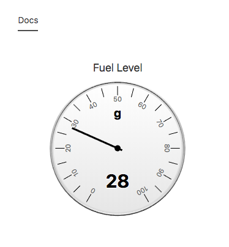
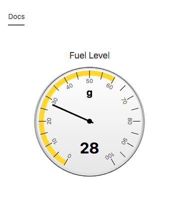

## Node Type Templates: Mech Gauge

### Introduction

The purpose of the mi-mech-gauge tag is to provide the user with a more detailed gauge. Really good for representing precise points of data.

## Syntax


At its core, the mi-mech-gauge is meant for representing a granular look at a node channels current value.



```
<sample-template>

    <mi-mech-gauge min='0' max='100' channel='fuel_level' unit='g'/>

</sample-template>

```

You can also set color ranges on the gauge. See below.



```
<sample-template>

    <mi-mech-gauge min='0' max='100' channel='fuel_level' unit='g' plotband={[{from:0,to:60,color:'gold'}]}/>
    
</sample-template>

```

## Notes

The plotband option only accepts an array of objects, which is different from the mi-simple-gauge. Inside each object, you define the beginning, end, and color of the plotband. Unlike mi-simple-gauge, you don't have to cover the full range of values.

Below we will cover the opts that can be passed to mi-mech-gauge.

---

**min**

Mandatory. String or number that represents the minimum threshold for the channel value.

---

**max**

Mandatory. String or number that represents the maximum threshold for the channel value.

---

**channel**

Mandatory. String that fetches the channel value. 

---

**unit**

Optional. String that represents the unit for the channel value. 

---
**plotband**

Optional. An array of objects. Inside each object follow this example:
- from: represents the beginning of the plotband.
- to: represents the end of the plotband.
- color: Accepts hex, rgb, rgba, color string. Sets the color of the plotband.
---