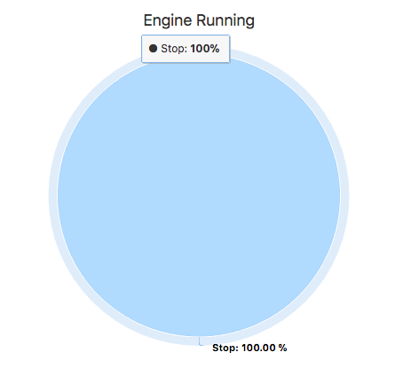
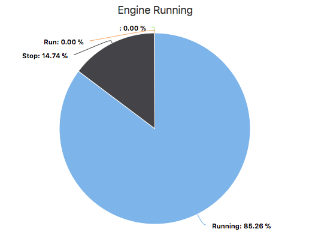

## Node Type Templates: Pie Chart

### Introduction

The purpose of the mi-pie is to show the amount of time spent in one channel value or state over time. Will redraw on update. 

The pie chart is redrawn on each websocket update. 

## Syntax


At its core, the mi-pie is a websocketed pie chart.



```
<sample-template>

    <mi-pie channel='engine_run'/>

</sample-template>

```



```
<sample-template>

    <mi-pie ref='p' channel='engine_run' start={moment().subtract(60, 'days').format()}/>

</sample-template>

```

Below we will cover the opts that can be passed to mi-pie.

---

**channel**

Mandatory. String of the literal channel name. Used for getting current value and subscribing to the websocket channel. 

---

**start**

Optional. Pass a moment time with how many days you wanna go back, follow the above example. Defaults to 1 day ago.  

---