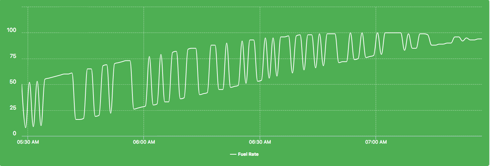
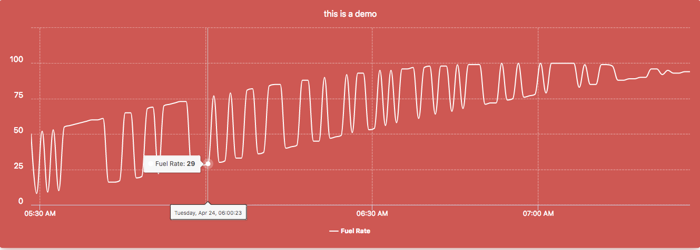

## Node Type Templates: Simple Chart

### Introduction

The purpose of the mi-simple-chart is to show a stylized graph meant for showcasing a single channel stream. 

The channel stream is websocketed.

### Syntax

[*Highcharts demo.*](https://www.highcharts.com/demo/line-basic)

The simplest line chart can be added as follows:



```
<sample-template>

	 <mi-simple-chart channels='fuel_rate'/>

</sample-template>

```

This will create a standard line chart with a week's worth of data for channels work_time and work_fuel. The 'channels' string is a comma-separated list of channel names. There are two in this example, but you can have as many as you want.

Often, however, you'll like to customize the chart more directly, whether in the colors, labels, display, etc. Meshify offers an alternative way to configure it:



```
<sample-template>
	<mi-simple-chart settings={settings}/>

	<script>

		var tag = this;
		tag.settings = {
            channels: [{
                name:'fuel_rate'
            }],
            remove_rangepicker:false,
            bg_color:'#CF564F',
            simple:true,
            label:'this is a demo',
        }

	</script>

</sample-template>

```

Notes
---


 Highcharts will only generate a timespan that has values in it. Let's say you make a 30 day request but 10 days are missing from the beginning or the end, that is because there isn't any data there. Highcharts will not show empty space before the first point or after the last point. 

 

This is just a sampling of the properties you can supply to the chart configuration object. Here is the full list of options.

---

**bg_color**

Optional. Hex string to define the color of the background and the surrounding glow.

---

**channels**

Either a comma-separated list of channel names, or an array of objects conforming to the example above.

The channel objects can include the following properties:

- name: The name of the channel
- label: The vanity name of the channel to show in the chart legend
- axis: Left or right, for which y-axis the data should be drawn on
- axis_label: An optional label to render on the chosen axis
- unit: The unit for each data point, rendered in tooltips
- color: The HTML/CSS color used to render the data, labels, etc.

All of these properties except 'name' are optional, with strong defaults.

*No default.*

*Only the comma-separated list of channels can be passed in separately without a settings object.*

---

**full_scale**

A boolean. Default is false. When set to true, each stream of data will have its own axis so that way you can see full resolution trends.

---

**height**

An integer. The height (in pixels) of the final chart.

*Defaults to 400. If the simple property is set to true, shrinks to 300.*

---

**id**

A string used to identify the chart when it fires events. See the Events section for more information.

*Defaults to 'chart'.*

---

**label**

A string for the label that appears at the very top of the chart.

*No default.*

*Label can also be passed in separately from the settings object.*

---

**ordinal**

A boolean. When set to true, Highstocks will equally space data points regardless of the actual time or x distance between them. Periods in which data was not sent (typically nights or weekends) will not occupy space on the chart. This makes for a more visually pleasing visualization, but can be misleading when there are periods of no data. 

*Defaults to false.*

---

**remove_axis**

A boolean. Defaults to false. When set to true, it removes the y-axis typically on the left side. This feature is useful in combination with full_scale. Each axis takes up too much horizontals space and will make your graph smaller and smaller with each channel added.

---

**remove_rangepicker**

A boolean. Defaults to false. When set to true, it removes the range picker from view. This is useful when you have one rangepicker controlling many charts in a single template. 

---

**sampling**

A boolean. By default, Highstocks samples data values into larger blocks to increase chart readability and performance. Data points that are close to one another (measured in pixels) are grouped and averaged, but will separate into individual points when you zoom into the chart. 

*Defaults to true.*

---

**simple**

A boolean. Simple mode strips out a lot of the accessory UI elements and offers a simple chart with a legend, the data points, and little else. It's ideal for list templates, where vertical space is limited.

*Defaults to false.*

---

**start_time**

An ISO8601 format timestamp. For the sake of your sanity, please use a Moment.js format() function call.

*Defaults to one week ago.*

*Start_time can be passed in separately from the settings object.*

### Events

The mf-chart tag will fire an event when the chart is fully rendered. You can listen to the event inside your template like so:

```
<sample-template>
	
	<mf-chart ref="temp_chart" settings={ chart_settings } />

	<script>

		var tag = this;
		tag.chart_settings = {
			id: "temp",
			channels: [
				{
					name: 'hum',
					label: 'Humidity',
					axis: 'left',
					axis_label: 'Humidity',
					unit: '%',
					color: '#E28F48'
				},
				{
					name: 'temp',
					label: 'Temperature',
					axis: 'right',
					axis_label: 'Temperature',
					unit: 'deg',
					color: '#93C9F4'
				}
			],
			label: "Chart",
			simple: true,
			start_time: moment().subtract(30, 'days').format(),
		}

		tag.on('temp_loaded', function(){
			<!-- Callback function to manipulate the chart. -->
			tag.refs.temp_chart.highcharts.setTitle({text: "Chart Has Loaded"});
		})

	</script>

</sample-template>

```

When the *id* property is supplied in a chart_setting configuration object, the mf-chart tag will fire an event structured like the following: `id_loaded.` This is useful for when you have multiple charts in the same template and need to interact with them all differently upon render.

When—and only when—the `_loaded` event is triggered, you can access the highcharts object on the loaded chart. Per Riot.js convention, it's best to add a ref ("temp_chart", in the example above) to the mf-chart tag. The highcharts object can then be accessed at `tag.refs[REF_NAME].highcharts`, and with it you can interact with the chart (adding plot bands, changing colors, etc.) using the full capabilities of the Highcharts library.
