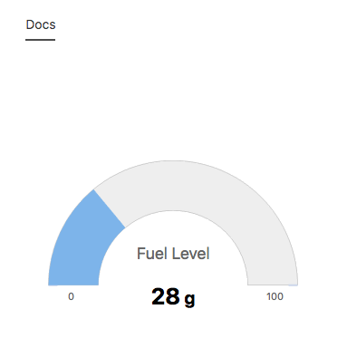
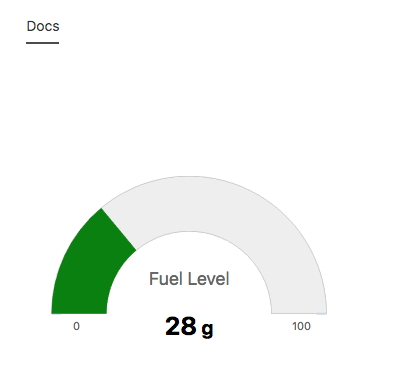
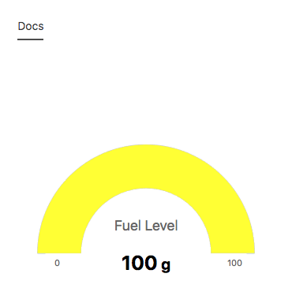

## Node Type Templates: Simple Gauge

### Introduction

The purpose of the mi-simple-gauge tag is to provide the user with a dashboard overview gauge. Really good for representing KPI percentages.

## Syntax


At its core, the mi-simple-gauge is meant for representing a quick glance at overall health of a node channel. The next image shows a basic simple gauge with its default color.



```
<sample-template>

    <mi-simple-gauge min='0' max='100' channel='fuel_level' unit='g'>

</sample-template>

```

You can also customize the color based on where the gauge is at as a percentage. Check out the example below




```
<sample-template>

    <mi-simple-gauge min='0' max='100' channel='fuel_level' unit='g' plotband={[[.5,'green'],[1.0,'yellow']]}>
    
</sample-template>

```

## Notes

The plotband option only accepts an array of arrays,  which is different from the mi-simple-gauge. Inside each array, the first index represents a decimal value between 0 and 1 and the second index represents the color. It is recommended that you cover the whole spectrum from 0 to 1 to avoid any buggy behavior with the color.

Below we will cover the opts that can be passed to mi-simple-gauge.

---

**min**

Mandatory. Accepts string or number that represents the minimum threshold for the channel value.

---

**max**

Mandatory. Accepts string or number that represents the maximum threshold for the channel value.

---

**channel**

Mandatory. String that fetches the channel value. 

---

**unit**

Optional. String that represents the unit for the channel value. 

---
**plotband**

Optional. An array of arrays. Inside each array, the first index represents a decimal value between 0 and 1 and the second index represents the color (Accepts hex, rgb, rgba, color string) . If your first array has .5, the gauge assumes that covers all values between 0 and 0.5. It is important to always cover the full range between 0 and 1 to avoid buggy color behavior.

---