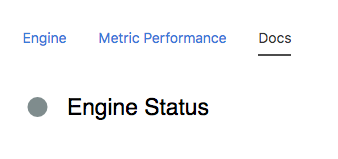
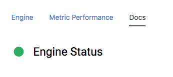
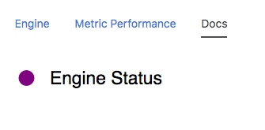

## Node Type Templates: Status Icon

### Introduction

The purpose of the mi-status-icon tag is to provide quick and easy ways to view the status of a particular channel, regardless of it being binary in nature or not.

## Syntax


At its core, the mi-status-icon can represent the health of a channel depending on that channel value.




```
<sample-template>

    <h2 class='card-value lh-copy' style='font-weight:400'> 
        <mi-status-icon class='mr2 lh-copy' on='Running' channel="engine_run" style='font-size:30px'/>
        Engine Status
    </h2>

</sample-template>

```

There are two ways to use this tool. Both require the channel opt. 
    1. You can use channel and "on" as opts. The value in "on" will be compared to the latest value of the channel, the icon will turn green if they match and gray if they don't. Shown above.
    2. You can use channel and cb as opts. cb is a function that returns a color. That way you can make logic as simple or as complex as needed to properly represent the color or status of that channel. 



```
<sample-template>

    <h2 class='card-value lh-copy' style='font-weight:400'> 
        <mi-status-icon class='mr2 lh-copy' channel="engine_run" cb={statusCheck} style='font-size:30px'/>
        Engine Status
    </h2>
    <script>
        var tag = this;
        tag.statusCheck = function(value){
            if(value==='Running'){
                return 'purple'
            }
        }
    </script>

</sample-template>

```

Below we will cover the opts that can be passed to mi-status-icon.

---

**channel**

Mandatory. String of the literal channel name. This is what fetches the channel value. 

---

**on**

Optional. Can be a boolean, string, or number. Used to compare to channel value for status color. If matched then green or else gray.

---

**cb**

Optional. Function that returns a color, can be hex, rgb, rgba, or color string. If both on and cb are present, cb will always take priority over on.

---
