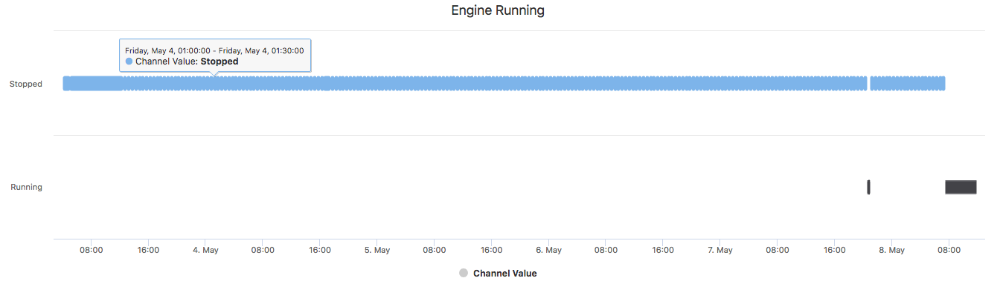
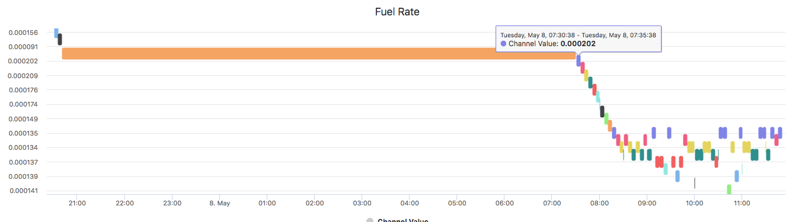

## Node Type Templates: Timeline Chart

### Introduction

The purpose of the mi-timeline is to show the amount of time spent in one channel value or state over time. Will redraw on update. 

The timeline chart is redrawn on each websocket update. 

## Syntax


At its core, the mi-timeline is a websocketed timeline. It works really well with string values as shown below.



```
<sample-template>

    <mi-timeline channel='engine_run'/>

</sample-template>

```

It can also show integers similar to a line chart.



```
<sample-template>

    <mi-timeline channel='engine_run' start={moment().subtract(60, 'days').format()}/>

</sample-template>

```

Below we will cover the opts that can be passed to mi-timeline.

---

**channel**

Mandatory. String of the literal channel name. Used for getting channel history and subscribing to websocket. 

---

**start**

Optional. Pass a moment time with how many days you wanna go back, follow the above example. Defaults to 30 day ago.  

---