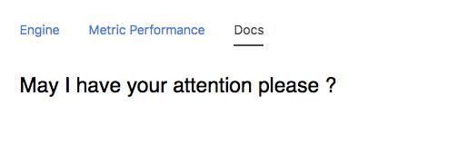

## Node Type Templates: Tooltip

### Introduction

The purpose of the mi-tooltip tag is to provide the user a tool that can shorten a string while being able to show the full string value as a tooltip hover event.

## Syntax


At its core, the mi-tooltip can shorten content while mainting its original length, or provide additional context to a short label.


```
<sample-template>

    <h2 class='card-value lh-copy' style='font-weight:400'> 
        <mi-tooltip label='Then the days go by like a strand in the wind'/>
    </h2>

</sample-template>

```

Below you will see the use of another opt called tooltip, which can show an alternate string as opposed to the original label. 




```
<sample-template>

    <h2 class='card-value lh-copy' style='font-weight:400'> 
        <mi-tooltip label='May I have your attention please ?' tooltip="Will the real tooltip please stand up?" max={20}/>
    </h2>
</sample-template>

```

Below we will cover the opts that can be passed to mi-tooltip.

---

**label**

Mandatory. String that is always shown. By default if the string is longer than 16 characters, it is cut short.

---

**tooltip**

Optional. Without this, the tooltip will just show the full string of the label. With this on, you can customize the tooltip string for a different output.

---

**max**

Optional. Integer that determines the string cutoff point for the label. Default is 16.

---
