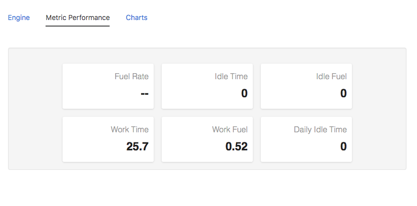
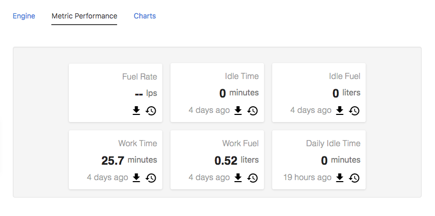
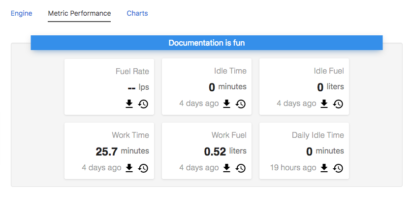
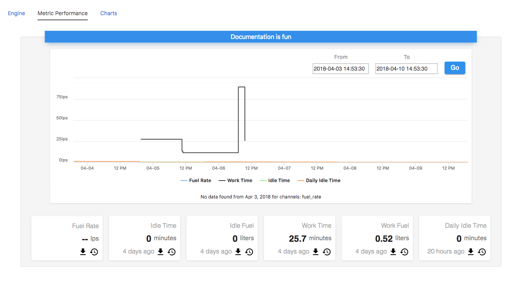

## Node Type Templates: Well

### Introduction

The purpose of the mi-well tag is to provide quick and easy ways to view timeseries data and latest channel values without having to think about design. 

## Channels


At its core, the mi-well can show the latest data values for a list of channels.



```
<sample-template>

    <mi-well settings={ well_settings }/>

    <script>
        var tag = this;
        tag.well_settings = {
            channels:
                [{
                    name: 'fuel_rate',
                },{
                    name: 'idle_time',
                },{
                    name: 'idle_fuel',
                },{
                    name: 'work_time',
                },{
                    name: 'work_fuel',
                },{
                    name: 'daily_idle_time',
                }]
        };
    </script>

</sample-template>

```

Let us look at the channel object in the channels array. The only mandatory key is the name which takes the literal channel name as input. Every other key is optional thus making the channel card like a set of legos with name as the mandatory base. 



```
<sample-template>

    <mi-well settings={ well_settings }/>

    <script>
        var tag = this;
        tag.well_settings = {
            channels:
            [{
                name: 'fuel_rate',
                unit:'lps',
                download_modal:true,
                download_button:true,
                timestamp:true
            
            },{
                name: 'idle_time',
                unit:'minutes',
                download_modal:true,
                download_button:true,
                timestamp:true
            
            },{
                name: 'idle_fuel',
                unit:'liters',
                download_modal:true,
                download_button:true,
                timestamp:true
            
            },{
                name: 'work_time',
                unit:'minutes',
                download_modal:true,
                download_button:true,
                timestamp:true
            
            },{
                name: 'work_fuel',
                unit:'liters',
                download_modal:true,
                download_button:true,
                timestamp:true
            
            },{
                name: 'daily_idle_time',
                unit:'minutes',
                download_modal:true,
                download_button:true,
                timestamp:true
            
            }]
        };
    </script>

</sample-template>

```

Notes
---
 As far as download_button and download_modal I would only require using one or the other seeing as though they both ultimately serve the same purpose and you dont want to crowd your card. 

 If a channel value is null then the card will return "--".

 When a new channel is set, the default timestamp is Dec 31, 1969. Awesome date but terrible for UI so if the timestamp is set to true and that date comes up, the timestamp area will show "" (empty string) instead. 

## Header

Outside of channels you can also set a header for the well. This is especially useful if you have more than one well on a single template.



```
<sample-template>

    <mi-well settings={ well_settings }/>

    <script>
        var tag = this;
        tag.well_settings = {
            channels:
            [{
                name: 'fuel_rate',
                unit:'lps',
                download_modal:true,
                download_button:true,
                timestamp:true
            
            },{
                name: 'idle_time',
                unit:'minutes',
                download_modal:true,
                download_button:true,
                timestamp:true
            
            },{
                name: 'idle_fuel',
                unit:'liters',
                download_modal:true,
                download_button:true,
                timestamp:true
            
            },{
                name: 'work_time',
                unit:'minutes',
                download_modal:true,
                download_button:true,
                timestamp:true
            
            },{
                name: 'work_fuel',
                unit:'liters',
                download_modal:true,
                download_button:true,
                timestamp:true
            
            },{
                name: 'daily_idle_time',
                unit:'minutes',
                download_modal:true,
                download_button:true,
                timestamp:true
            
            }],
            header: {
            	label:'Documentation is fun',
              	color:'#3091ED'
            }
        };
    </script>

</sample-template>

```

Notes
---
The color can only be done in hex, if you look closely there is a glow that is set to the hex. There is logic in the mi-well which converts hex colors to rgba which is necessary for the box-shadow.

## Chart

All these channels can easily be rendered on a chart. With just one line of code!


```
<sample-template>

    <mi-well settings={ well_settings }/>

    <script>
        var tag = this;
        tag.well_settings = {
            channels:
            [{
                name: 'fuel_rate',
                unit:'lps',
                download_modal:true,
                download_button:true,
                timestamp:true
            
            },{
                name: 'idle_time',
                unit:'minutes',
                download_modal:true,
                download_button:true,
                timestamp:true
            
            },{
                name: 'idle_fuel',
                unit:'liters',
                download_modal:true,
                download_button:true,
                timestamp:true
            
            },{
                name: 'work_time',
                unit:'minutes',
                download_modal:true,
                download_button:true,
                timestamp:true
            
            },{
                name: 'work_fuel',
                unit:'liters',
                download_modal:true,
                download_button:true,
                timestamp:true
            
            },{
                name: 'daily_idle_time',
                unit:'minutes',
                download_modal:true,
                download_button:true,
                timestamp:true
            
            }],
            header: {
            	label:'Documentation is fun',
              	color:'#3091ED'
            },
            chart:true
        };
    </script>

</sample-template>

```

You can also exclude certain channels from being on the chart or decide which side the y-axis for that channel should be on.



```
<sample-template>

    <mi-well settings={ well_settings }/>

    <script>
        var tag = this;
        tag.well_settings = {
            channels:
            [{
                name: 'fuel_rate',
                unit:'lps',
                download_modal:true,
                download_button:true,
                timestamp:true,
            
            },{
                name: 'idle_time',
                unit:'minutes',
                download_modal:true,
                download_button:true,
                timestamp:true,
            
            },{
                name: 'idle_fuel',
                unit:'liters',
                download_modal:true,
                download_button:true,
                timestamp:true,
              	chart_ignore:true
            
            },{
                name: 'work_time',
                unit:'minutes',
                download_modal:true,
                download_button:true,
                timestamp:true,
            
            },{
                name: 'work_fuel',
                unit:'liters',
                download_modal:true,
                download_button:true,
                timestamp:true,
              	chart_ignore:true
            
            },{
                name: 'daily_idle_time',
                unit:'minutes',
                download_modal:true,
                download_button:true,
                timestamp:true,
            
            }],
            header: {
            	label:'Documentation is fun',
              	color:'#3091ED'
            },
            chart:true
        };
    </script>

</sample-template>

```

Only two of the channels have chart_ignore set to true so the chart will only render the other 4 channels.
Below you will see a breakdown of the key and value properties that can be configured.

---

**channels**

An array of objects.

The channel object can include the following properties:

- name: (Mandatory) The name of the channel.
- unit: (Optional, String) Unit corresponding to the channel value.
- timestamp: (Optional, Boolean) Shows time relative to the present, on hover it shows the local time via tooltip.
- download_modal: (Optional, Boolean) Renders a history modal button at the bottom of the card.
- download_button:(Optional, Boolean) Renders a download button next at the bottom of the card.
- chart_ignore: (Optional, Boolean) If true, the chart will ignore this channel from being rendered.

---

**header**

An object.

The header object can include the following properties:

- label: (Mandatory, String) String contained in the header
- color: (Mandatory, String) A hex color string. WILL NOT ACCEPT rgba or color names

---

**chart**

For now, a boolean. True or false. 

---
